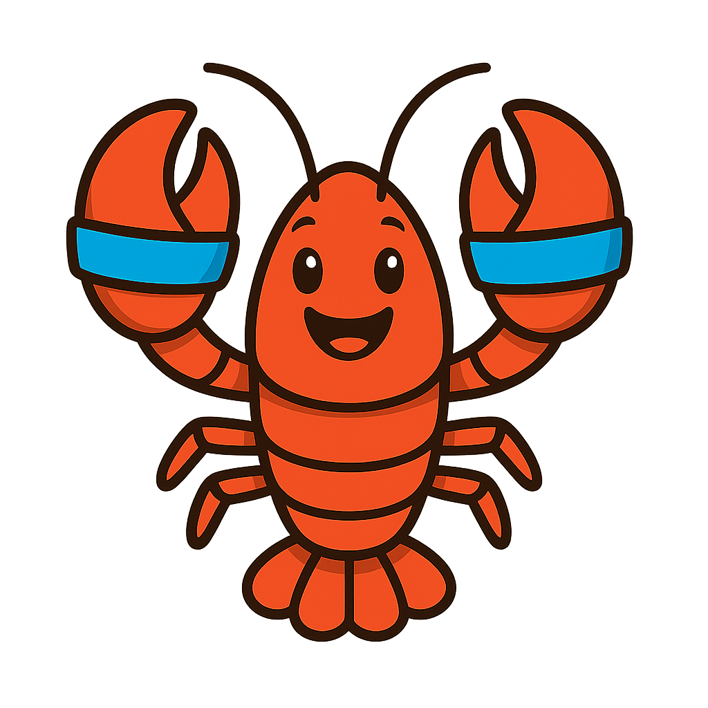

<p align="center">
  
</p>

# RubberBand 🦞🔵

Static command pattern detection for [OpenClaw](https://github.com/openclaw/openclaw). Catches dangerous exec commands (credential access, exfiltration, reverse shells) as defense-in-depth against prompt injection.

> Like the bands on lobster claws that keep them from pinching — this feature bands the dangerous parts so the agent can't pinch the operator.

## 🚀 Install (Plugin)

The easiest way to use RubberBand — no fork required:

```bash
openclaw hooks install @jeffaf/openclaw-rubberband
```

Then add to your OpenClaw config:

```yaml
plugins:
  rubberband:
    enabled: true
    mode: enforce  # or 'shadow' for log-only
```

Defaults to **shadow mode** (logs detections without blocking) so you can see what it catches first.

## Status

**Plugin:** [`@jeffaf/openclaw-rubberband`](https://github.com/jeffaf/rubberband-plugin) — standalone hook, works with any OpenClaw install
**PR:** [#24958](https://github.com/openclaw/openclaw/pull/24958) — native integration (pending review)
**RFC:** [Discussion #4981](https://github.com/openclaw/openclaw/discussions/4981)

---

## What It Detects

| Category | Examples | Coverage |
|----------|----------|----------|
| **Credential Access** | SSH keys, AWS creds, API tokens, SAM/SYSTEM, mimikatz | ✅ |
| **Data Exfiltration** | curl POST, wget, certutil, bitsadmin | ✅ |
| **Reverse Shells** | nc -e, bash /dev/tcp, PowerShell, python/ruby/perl | ✅ |
| **Persistence** | crontab, schtasks, registry Run keys, LaunchAgents | ✅ |
| **Container Escape** | docker -v /, kubectl exec | ✅ |
| **Indirect Execution** | eval, pipe to shell, IEX, encoded commands | ✅ |

**Tested:** 134 bypass techniques, 98.5% detection rate, 0 false positives

## How It Works

```
Agent exec(command)
       │
       ▼
┌──────────────────────────────┐
│  Existing allowlist check    │
└──────────────────────────────┘
       │
       ▼
┌──────────────────────────────┐
│  RubberBand pattern check    │
│  • Normalize (Unicode, URLs) │
│  • Pattern match             │
│  • Context-aware scoring     │
└──────────────────────────────┘
       │
       ├─ BLOCK → throw error
       ├─ ALERT → log warning
       └─ ALLOW → proceed
       │
       ▼
┌──────────────────────────────┐
│  runExecProcess()            │
└──────────────────────────────┘
```

## Bypass Protections

- **Unicode normalization (NFKC)** — Catches Cyrillic lookalikes
- **URL decoding** — Catches %7e for ~
- **Shell escape expansion** — Catches $'\x7e'
- **Path normalization** — Catches // and /./ obfuscation
- **Context-aware scoring** — Stripped content + execution pattern = higher risk

## Performance

**Detection overhead:** ~0.005ms per command

Effectively invisible — typical exec takes 10-50ms for process spawning.

## Documentation

- [OpenClaw Integration Plan](docs/OPENCLAW-INTEGRATION.md)
- [Security Engineering Notes](docs/SECURITY-ENGINEERING.md)
- [Host-Specific Detections](docs/HOST-SPECIFIC-DETECTIONS.md)

## Get Involved

- 📦 **Plugin:** [`@jeffaf/openclaw-rubberband`](https://github.com/jeffaf/rubberband-plugin)
- 💬 **Feedback:** [Discussion #4981](https://github.com/openclaw/openclaw/discussions/4981)
- 🔧 **PR:** [#24958](https://github.com/openclaw/openclaw/pull/24958)
- 🐛 **Issues:** Open an issue here or comment on the Discussion

## License

MIT

## Credits

Created by [@_jeffaf](https://twitter.com/_jeffaf) with help from Mai 🐱

Part of the [OpenClaw](https://github.com/openclaw/openclaw) ecosystem.
